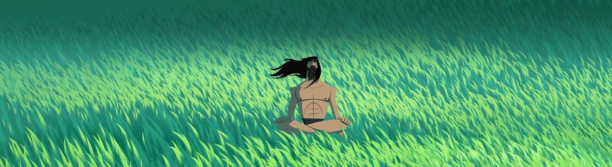
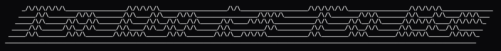

# hey, i'm amrut

cs grad @ WPI. i build backend systems, ship AI tools, and occasionally implement distributed consensus algorithms for fun.

---



**right now i'm building:**
- **[EduOrch](./eduorch_hld.html)** — on-prem agentic system for educators to manage Canvas LMS via natural language CLI. FERPA-compliant, Git-backed, Llama 3.1 70B on WPI's ARC cluster
- **[TAARS](https://github.com/amrutsavadatti/TAARS)** — AI portfolio chatbot with a custom RAPTOR retrieval system. no vector DBs, just fast and cheap
- **[caveman-compress](https://github.com/amrutsavadatti/caveman)** — Claude skill that compresses AI memory files ~45% without losing meaning
- **OpenClaw** — multi-agent orchestrator routing tasks across Claude + OpenAI with quality loops and Discord/Telegram updates

**and before that:** 3 years at Media.net shipping Kafka APIs, data pipelines across 30+ integrations, and a backend serving 400+ publisher sites

---

**also built:** [RAFT consensus from scratch](https://github.com/amrutsavadatti/RAFT-consensus) · [Beecology platform](https://beecology.wpi.edu/react_webapp/) · Custom MCP server (FastAPI + OAuth + Google Calendar)

---

```
  ⚡ certified: Claude Code in Action · Claude 101 · Intro to Agent Skills · AWS GenAI
```

**stack:** Python · Java · Claude API · Kafka · FastAPI · Spring Boot · React · Docker · AWS

---

[LinkedIn](https://in.linkedin.com/in/amrut-savadatti-277069183) · amrutsavadatticareers@gmail.com
